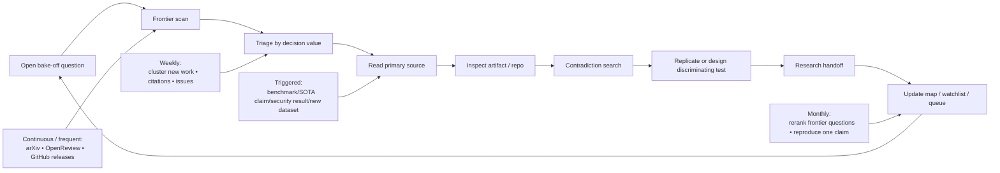

# MEMORY BAKE-OFF RESEARCH INTELLIGENCE DIRECTIVE

## Executive summary and assumptions

This directive treats the bake-off as a **research-intelligence and experimental-design program**, not as a leaderboard exercise. The field has moved beyond "retrieve a fact from an old chat." Recent benchmarks separately expose lifecycle operations, evolving state, future reuse of feedback, environment-specific procedural knowledge, memory-to-action behavior, security, multimodal history, and cost. MemOps explicitly decomposes remembering, forgetting, updating, and reflecting; LongMemEval-V2 tests static state, dynamic state, workflow knowledge, gotchas, and premise awareness over histories reaching 115 million tokens; StreamMemBench finds that committing an intervening interaction materially changes later reuse; and MemSecBench shows that persistence itself creates a durable attack surface. citeturn19view0turn20view5turn17view2turn19view1

The highest-leverage change to the bake-off is therefore to stop asking **"Which memory product scores highest?"** and ask **"Which mechanisms produce which benefits, under which histories, failure modes, model backbones, costs, and state semantics?"** Current evidence already warns against a universal winner: EvoMemBench reports that long-context baselines remain highly competitive and that different forms of memory win on different tasks; an August 12, 2026 controlled cost study finds that no tested memory system dominates both accuracy and serving cost and that break-even can range from tens of turns to beyond 400 turns; Memora finds frequent reuse of invalid memories and only marginal gains from tested memory agents. citeturn19view3turn20view3turn17view4

The directive consequently recommends five priorities:

| Priority | Operational consequence |
|---|---|
| **Mechanisms before brands** | Freeze common backbones, judges, embeddings, budgets, and histories; vary one memory mechanism at a time. |
| **State evolution before static recall** | Make supersession, effective time, corrections, reconstruction, forgetting, and provenance mandatory test dimensions. |
| **Coding experience before chat-only memory** | Build persistent multi-task coding workloads from real software-engineering environments rather than extrapolating from persona/chat QA. |
| **Formation + use, not retrieval alone** | Instrument what is admitted, consolidated, retrieved, injected, acted upon, and subsequently revised. |
| **Pareto frontiers, not one score** | Report task utility against latency, ingest cost, retrieval cost, token consumption, storage growth, contamination, and security. |

A second major conclusion is methodological: **there is not yet a defensible global "SOTA memory system."** Agent Zero Memory, submitted August 30, 2026, reports 95.60% on LongMemEval and 93.60% on LoCoMo, while other systems report strong results under differing implementations, backbones, judges, benchmark versions, and retrieval budgets. LongMemEval-V2 itself produces a different frontier, where a coding-agent-based context gatherer scores 72.5% but with substantial latency. A public Agent Memory Leaderboard is attempting standardized Add/Search evaluation and now has separate textual and coding tracks, but its first evaluation cycle only began July 29, 2026 and its second is expected September 20, 2026. Treat all "SOTA" claims as **protocol-local until independently reproduced under the bake-off harness**. citeturn20view0turn20view5turn16view3

**Assumptions.** Budget, team size, and deadline are unspecified. The directive therefore prioritizes research leverage, parallelizable work, and experiments that eliminate architecture classes quickly rather than optimizing for a fixed resource ceiling. The fleet is assumed able to browse arXiv/OpenReview/conference proceedings, inspect public repositories, execute open-source systems, and call commercial APIs where useful. English-language primary sources are preferred. The target is persistent **coding and agentic systems**, not only chat personalization. Open-source reproducibility is weighted above inaccessible proprietary implementations, while commercial systems remain valid observational baselines. Licensing must be checked before dataset redistribution or incorporation into products. This is a frontier snapshot as of **September 13, 2026**.

**Directive in one sentence:** maintain a live causal map from **research claim → artifact → mechanism → discriminating experiment → bake-off decision**, and reject research that cannot eventually move one of those edges.

## Mission and research landscape

**1) Intelligence Mission**

The fleet's mission is to discover evidence that can change an **experiment, architecture hypothesis, benchmark, or research priority**.

A useful discovery is not merely a new paper. It is one of four things: a mechanism the fleet has not isolated; evidence falsifying a current assumption; an artifact that makes a better experiment possible; or a neighboring discipline that already possesses a useful formulation of a problem the memory field is treating informally.

The fleet should optimize for **expected decision value**, not citation count or novelty. A tiny paired ablation showing that the write path matters may be more valuable than another system claiming a benchmark record. StreamMemBench is a good model: on a paired 160-trajectory subset, later-task success averaged 27.5% without committing the preceding interaction and 40.6% after committing it, a 13.1-point gain under the same later query. That result converts "memory formation matters" into an experimentally separable mechanism. citeturn17view2

Researchers should continuously seek evidence answering five control-plane questions:

1. **What information should become durable state?**
2. **How should durable state change when reality changes?**
3. **How should an agent find and use the right state at the right moment?**
4. **When does external memory beat simpler alternatives?**
5. **What new failures become possible because memory exists?**

**2) Research Map**

```mermaid
graph TD
    A[Memory Bake-off]

    A --> B[Capture & Formation]
    A --> C[State Semantics & Evolution]
    A --> D[Retrieval & Context Assembly]
    A --> E[Experience & Procedural Knowledge]
    A --> F[Evaluation Science]
    A --> G[Trust, Provenance & Governance]
    A --> H[Systems Economics]

    B --> B1[Information extraction]
    B --> B2[Admission / salience]
    B --> B3[Consolidation / compression]
    B --> B4[Observer models]
    B --> B5[Online learning / admission policies]

    C --> C1[Temporal DBs]
    C --> C2[Bitemporal state]
    C --> C3[Event sourcing / CDC]
    C --> C4[Belief revision]
    C --> C5[State estimation / POMDPs]

    D --> D1[Information retrieval]
    D --> D2[Long context]
    D --> D3[Graph / hybrid retrieval]
    D --> D4[Context compression]
    D --> D5[Selective prediction / abstention]

    E --> E1[Experience replay]
    E --> E2[Case-based reasoning]
    E --> E3[Process mining]
    E --> E4[Workflow / skill learning]
    E --> E5[SWE agent trajectories]

    F --> F1[Causal ablations]
    F --> F2[Judge reliability]
    F --> F3[Metamorphic testing]
    F --> F4[Longitudinal evaluation]

    G --> G1[Data lineage]
    G --> G2[Scope isolation]
    G --> G3[Memory poisoning]
    G --> G4[Selective deletion]
    G --> G5[Auditability]

    H --> H1[Latency]
    H --> H2[Token & model cost]
    H --> H3[Storage growth]
    H --> H4[Observability]
```



The existing field already supplies empirical reasons to separate these territories. Hindsight explicitly splits memory into world facts, agent experiences, synthesized observations, and evolving opinions and implements retain/recall/reflect operations; Zep/Graphiti explores temporal graph representation; AMA-Bench argues that similarity retrieval loses causal and objective information from agent trajectories; LongMemEval-V2 shows that workflow and environment knowledge differ from ordinary chat recall; and MemOps argues for operation-level evaluation rather than judging only final answers. citeturn18view5turn18view4turn19view4turn20view5turn19view0

| Territory | Why it matters to bake-off | Search terminology | Maturity | Experimental payoff |
|---|---|---|---|---|
| **Capture / formation** | Retrieval cannot recover what was never encoded correctly. | admission, observation extraction, salience, consolidation, commit, durable state | Medium | **Very high** |
| **Temporal/state semantics** | "Latest fact" is insufficient when facts have validity intervals, corrections, branches, or retrospective updates. | valid time, transaction time, bitemporal, supersession, state reconstruction, event log | Low in LLM-memory; mature in databases | **Very high** |
| **Retrieval / assembly** | Vector similarity, graphs, files, lexical retrieval, agentic search, and long context are competing mechanisms. | hybrid retrieval, contextual retrieval, evidence gathering, hierarchical indexing, query planning | High | **Very high** |
| **Procedural experience** | Coding agents need reusable lessons about repos, tools, failed approaches, workflows and gotchas, not just facts. | experience replay, runbook, workflow knowledge, failure trajectory, case-based reasoning | Rapidly emerging | **Very high** |
| **Forgetting / revision** | Stale state can actively harm behavior. | selective forgetting, invalidation, deletion, update, contradiction resolution | Low–medium | **Very high** |
| **Provenance / epistemics** | The system must distinguish observed evidence, derived summaries, beliefs and generated guesses. | provenance, lineage, evidence pointer, citation lock, confidence, epistemic state | Emerging | **High** |
| **Evaluation science** | Small protocol differences can dominate nominal architecture differences. | paired ablation, judge bias, construct validity, causal benchmark, counterfactual evaluation | Medium | **Very high** |
| **Security / isolation** | Persistent state creates cross-session persistence and poisoning risks. | memory poisoning, persistence attack, tenant isolation, scope leakage, selective repair | Emerging | **High** |
| **Economics / scaling** | Expensive extraction or reflection can erase context-saving advantages. | break-even, ingest cost, retrieval latency, cost-per-correct, storage growth | Emerging | **High** |

**Additional adjacent seams the fleet should explicitly mine:** state estimation and POMDP belief tracking for uncertain evolving state; **process mining** for deriving workflows and failure patterns from execution logs; **data lineage/change-data-capture** for provenance-preserving updates; selective prediction and calibration for deciding when not to write or recall; online learning/bandits for admission and retrieval policies; and rate-distortion/information-bottleneck thinking for deciding what compression can safely discard. These are proposed transfer targets, not claims that their methods will automatically outperform current memory systems.

**3) Frontier Questions**

The research queue should treat these as the highest-value unresolved questions, in approximately this order:

| Rank | Frontier question | Why unresolved / decision value |
|---|---|---|
| **A** | **When should an interaction become memory at all?** | StreamMemBench shows formation matters, but the field lacks a generally validated admission policy across coding, dialogue and web-agent workloads. citeturn17view2 |
| **A** | **What state representation best supports changing reality?** | Flat facts, temporal graphs, event timelines, documentary summaries and raw histories all have plausible advantages; no common controlled bake-off isolates them. citeturn18view4turn18view5turn20view0 |
| **A** | **Does persistent memory beat full/rolling context on realistic coding workloads, and where is crossover?** | Current cost studies are predominantly conversational; even there, crossover varies sharply by architecture and backbone. citeturn20view3 |
| **A** | **Can procedural experience from prior coding tasks improve later tasks without causing negative transfer?** | LongMemEval-V2 establishes large gains from environment-specific runbooks in web agents, making the analogous coding question especially valuable. citeturn20view5 |
| **A** | **How should corrections and supersession propagate through derived memories?** | Memora and MemOps show stale-state and lifecycle failures; revision is not solved by better nearest-neighbor retrieval. citeturn17view4turn19view0 |
| **A** | **What is the smallest observer/distiller model that preserves decision-relevant events?** | Strong memory architectures increasingly use nontrivial ingestion pipelines, but backbone and pipeline compute can materially affect economics. citeturn18view5turn20view3 |
| **B** | **Does causal/event structure outperform similarity retrieval specifically on agent trajectories?** | AMA-Bench reports a strong result in favor of causal graph/tool retrieval, but independent replication across coding traces is needed. citeturn19view4 |
| **B** | **How much raw evidence must be retained behind compressed state?** | MemForest reports large compression with modest reported score loss, while provenance-oriented systems retain evidence links; the safe compression frontier remains workload-dependent. citeturn20view1turn20view0 |
| **B** | **When should an agent retrieve versus search its own archival files versus consume long context?** | LME-V2's coding-agent evidence gatherer beats RAG but costs more latency, suggesting query-dependent routing may be superior to one mechanism. citeturn20view5 |
| **B** | **Can autonomous memory management outperform engineered policies robustly?** | SelfMem's July 4, 2026 preprint reports strong BEAM improvements through self-optimization, but this is recent and requires cross-task validation. citeturn20view2 |
| **B** | **What memory-induced security failures exist in normal operation, not just adversarial benchmarks?** | MemSecBench and MemGate make persistence, leakage and untrusted retrieved state first-class issues. citeturn19view1turn19view2 |
| **C** | **How should multiple agents share durable knowledge without collapsing provenance and scope?** | Current memory workshops explicitly identify multi-agent memory as an open area, but standardized operational tests remain immature. citeturn16view0 |

## Frontier evidence and monitoring map

**4) SOTA & Emerging Threads**

Use **SOTA only relative to a fixed benchmark version, harness, backbone, judge and budget.** Cross-paper scores should be treated as leads to reproduce, not rank-order truth.

| Status | Thread | Evidence and date | Directive |
|---|---|---|---|
| **Foundational** | Very-long multi-session conversational evaluation | LoCoMo was submitted **Feb. 27, 2024** and established long multi-session QA, temporal/causal reasoning and summarization as memory tests. citeturn18view0 | Keep as compatibility benchmark; do not let it define the whole program. |
| **Foundational** | Explicit long-term interactive abilities | LongMemEval, first submitted **Oct. 14, 2024**, tests extraction, multi-session reasoning, temporal reasoning, knowledge updates and abstention. citeturn18view1 | Retain as a clean lifecycle baseline. |
| **Current strong evidence** | Competency decomposition | MemoryAgentBench, accepted to ICLR 2026 on **Jan. 26, 2026**, evaluates retrieval, test-time learning, long-range understanding and conflict resolution and releases an MIT-licensed harness. citeturn18view2 | Borrow competency-level scoring rather than aggregate-only scoring. |
| **Current strong evidence** | Agent-experience benchmarks | AMA-Bench was submitted **Feb. 26, 2026** and reports weaknesses in similarity-only retrieval; LongMemEval-V2 on **May 12, 2026** extends evaluation to workflows, dynamic state and gotchas over histories as large as 115M tokens. citeturn19view4turn20view5 | Highest-priority family for coding-agent transfer. |
| **Current strong evidence** | Lifecycle evaluation | MemOps was submitted **July 14, 2026** and separately measures remember/forget/update/reflect behavior; it reports session-level retrieval beating turn-level retrieval and long-context weakness on ordered state reconstruction. citeturn19view0 | Incorporate operation traces into the bake-off. |
| **Current strong evidence** | Staleness-aware evaluation | Memora, ACL Findings **July 2026**, finds frequent reuse of invalid memories and marginal improvement from tested memory agents. citeturn17view4 | Make obsolete-memory penalties mandatory. |
| **Current strong evidence** | Cost/accuracy joint evaluation | *Total Recall at What Cost?*, **Aug. 12, 2026**, measures three memory systems against rolling/full context and finds no universal cost/accuracy winner. citeturn20view3 | Report cost-per-useful-outcome, not token savings alone. |
| **Emerging** | Provenance-first composite memory | Agent Zero Memory, **Aug. 30, 2026**, combines event timeline, entity-event graph and documentary memory with citation-locked retrieval and reports 95.60 LongMemEval / 93.60 LoCoMo. citeturn20view0 | Reproduce components separately before treating claimed SOTA as established. |
| **Emerging** | Compression preserving temporal structure | MemForest, **Sept. 8, 2026**, reports retaining 97.1% of Mem0 performance at 50% memory compression with 1.89× retrieval speedup across three benchmarks. citeturn20view1 | Immediately test whether the result survives correction-heavy and coding trajectories. |
| **Emerging** | Self-optimizing policies | SelfMem, **July 4, 2026**, lets agents refine their own memory strategy and reports sizable BEAM gains from 100K–1M tokens. citeturn20view2 | Treat policy optimization as an experimental arm, not yet default architecture. |
| **Emerging** | Memory as security boundary | MemGate, **June 4, 2026**, introduces a lightweight gate against risky memory retrieval; MemSecBench, **July 29, 2026**, evaluates poisoning through write, execute and repair stages. citeturn19view2turn19view1 | Add adversarial and accidental contamination before deployment conclusions. |
| **Emerging** | Scale beyond ordinary chat | BEAM generates coherent dialogues up to **10M tokens**, with 100 conversations and 2,000 validated questions; LongMemEval-V2 pushes agent histories beyond 100M tokens. citeturn18view6turn20view5 | Use them to stress scaling, not to substitute for real coding histories. |
| **Speculative / promising** | Temporal-database-style memory semantics | Recent work increasingly treats memory as evolving governed state rather than a bag of embeddings; this aligns with the bake-off's bitemporal/state-reconstruction concerns but is less independently validated than mainstream retrieval work. | Prototype as a mechanistic arm; demand state-level invariants. |

The most important emerging pattern is a shift from **"store snippets and retrieve top-k" to "maintain an evolving, queryable state substrate."** Hindsight separates evidence-like facts, experiences, observations and beliefs; LME-V2 stores raw observations, events and strategy notes or delegates evidence gathering to a coding agent; Agent Zero combines timeline, graph and documentary layers; MemOps exposes lifecycle transitions explicitly. This convergence is more important than any particular product score. citeturn18view5turn20view5turn20view0turn19view0

**5) Source Map**

Researchers should use a **source ladder**: frontier feeds discover candidates; primary papers establish claims; repositories and datasets establish what actually exists; issues/changelogs expose implementation reality; controlled local reproductions decide whether the claim enters the bake-off.

| Source lane | Concrete sources to monitor | Why / cadence |
|---|---|---|
| **Dedicated memory forums** | [MemAgents @ ICLR 2026](https://sites.google.com/view/memagent-iclr26/); PALM @ NeurIPS 2026/OpenReview | MemAgents explicitly spans architectures, retrieval/context management, temporal credit assignment, neuroscience, software tools and multi-agent memory. PALM is a 2026 long-term-memory/personalization hub. citeturn16view0turn16view1 |
| **Long-context frontier** | [Long Context Foundation Models @ NeurIPS 2026](https://longcontextfm.github.io/); OpenReview | Current workshop explicitly targets long-context/long-horizon agents, efficiency and robust evaluation; its 2026 submission deadline is **Sept. 13**, making its upcoming submissions unusually timely. citeturn16view2 |
| **Core ML/NLP** | ICLR, ICML, NeurIPS; ACL/EMNLP/NAACL proceedings | MemoryAgentBench reached ICLR 2026; Memora and other lifecycle/memory work appeared at ACL 2026, showing that material work is distributed across general venues rather than one memory conference. citeturn18view2turn17view4 |
| **IR / retrieval** | SIGIR, ECIR; arXiv cs.IR | Search ranking, hybrid retrieval, reranking and evaluation often mature here before being repackaged as agent memory. Use for mechanisms, not "agent memory" keywords. |
| **Database / systems** | SIGMOD, VLDB; arXiv cs.DB | Mine temporal databases, provenance, versioning, event histories, streaming/state systems and query planning. This is especially important for supersession and point-in-time reconstruction. |
| **Software engineering** | ICSE, FSE, SWE-bench ecosystem, SWE-Gym, SWE-smith | Real repository tasks provide far better substrates for persistent coding experience than chat-only benchmarks. SWE-Gym contains 2.4K real tasks from 11 Python repos and executable verification. citeturn15view0 |
| **Benchmarks / public comparison** | [Agent Memory Leaderboard](https://agentmemoryleaderboard.ai/) | Separate textual and coding-agent tracks, public Add/Search interface, reproducibility requirements for academic submissions; monitor protocol changes more than raw rank. citeturn16view3 |
| **arXiv frontier** | cs.AI, cs.CL, cs.LG, cs.IR, cs.DB, cs.SE, cs.CR, cs.MA | Search title/abstract deltas daily; recent relevant work is arriving within days of this directive, e.g. MemForest on Sept. 8. citeturn20view1 |
| **Implementation reality** | GitHub releases, commits, issues, benchmark scripts, Docker configs | Compare paper protocol with executable defaults; pin commits and inspect scoring scripts before accepting published numbers. |
| **Engineering signal** | Mem0, Zep/Graphiti, Letta, Mastra, Hindsight docs/blogs/release notes | Production systems expose implementation choices—background consolidation, graph indexing, observers, namespacing—often before academic comparisons catch up. Treat vendor metrics as hypotheses. citeturn18view3turn18view4turn18view5 |
| **Curated discovery indexes** | Awesome Agent Memory/related curated repositories, MemoryData-style harness collections | Good recall mechanism for finding code and datasets; never use inclusion or stars as evidence of quality. |

The fleet should **not merely "monitor arXiv."** For each strong paper, traverse: authors → previous papers → references → papers that cite the anchor → associated repository → issues/PRs → datasets → benchmark submissions → workshop where the authors next appear. One good anchor should generate an **idea lineage**, not one reading note.

**6) People / Project Watchlist**

Signal density is scored for likely value to this bake-off, not prestige.

| Watch target | Signal | Why monitor |
|---|---:|---|
| **Di Wu / Kai-Wei Chang / LongMemEval line** | **Very high** | LongMemEval evolved into LongMemEval-V2, moving from conversational histories to 115M-token web-agent trajectories, dynamic state, workflows and gotchas. This is almost exactly the shift the coding bake-off needs. citeturn18view1turn20view5 |
| **Yuanzhe Hu / Julian McAuley / MemoryAgentBench–MemoryArena line** | **Very high** | Competency-oriented evaluation and continued movement toward agentic tasks; project repo is MIT licensed and actively updated in 2026. citeturn18view2 |
| **Hindsight project / retain–recall–reflect line** | **Very high** | Explicit epistemic separation, temporal facts, multi-strategy retrieval and reflection make it a rich architecture to ablate rather than simply benchmark. citeturn18view5 |
| **Zep / Graphiti** | **High** | One of the clearest production-oriented temporal-knowledge-graph lines; relevant to validity intervals, entities and historical relationships. citeturn18view4 |
| **Mem0** | **High** | Widely used extract/store/retrieve baseline with released implementation and published production-oriented evaluation; useful reference point for simple fact memory. citeturn18view3 |
| **AMA-Bench / AMA-Agent team** | **Very high** | Directly challenges similarity-only retrieval and introduces causal graph retrieval for agent trajectories. citeturn19view4 |
| **MemOps / StreamMemBench teams** | **Very high** | These projects move measurement inside the lifecycle: explicit operations, commits, correction reuse and future assistance. citeturn19view0turn17view2 |
| **SWE-Gym / SWE-smith ecosystem** | **Very high** | High-value substrate for creating repeatable multi-episode coding-memory experiments from real repository tasks and generated verified tasks. citeturn15view0turn15view1 |
| **Agent Memory Leaderboard** | **High** | Early public attempt to normalize Add/Search interfaces and separate coding from textual memory. Its protocol and submissions may be a faster signal than papers. citeturn16view3 |
| **MemAgents / PALM / LCFM organizer and author networks** | **High discovery value** | These forums concentrate emerging work before citation counts mature; MemAgents explicitly connects AI, RL, cognitive psychology and neuroscience. citeturn16view0turn16view2 |
| **Security line: MemGate / MemSecBench** | **High** | Likely to expose architecture requirements absent from accuracy-centric benchmarks, especially memory admission, trust labels and selective repair. citeturn19view2turn19view1 |
| **Newest provenance/compression line: Agent Zero / MemForest** | **High, low confidence** | Both are weeks or days old as of this directive; watch for code, replications, corrections and follow-on work rather than accepting headline scores. citeturn20view0turn20view1 |

## Discovery vocabulary and reusable substrate

**7) Search Vocabulary & Discovery Queries**

The fleet should maintain a living ontology whose purpose is to defeat terminology lock-in.

**Core concept families**

| Bake-off concept | Search outside "memory" terminology |
|---|---|
| What to keep | salience, admission policy, event extraction, information filtering, sufficient statistic, selective retention |
| Changing truth | effective time, valid time, transaction time, temporal versioning, supersession, belief revision |
| Durable project state | event sourcing, change-data-capture, state reconstruction, materialized view, audit log |
| Finding old evidence | evidence retrieval, context gathering, hybrid search, query planning, case retrieval |
| Learning from tasks | experience replay, case-based reasoning, workflow induction, runbooks, procedural knowledge |
| Summarizing history | context compression, hierarchical summarization, rate-distortion, incremental summarization |
| Using prior feedback | test-time learning, online adaptation, feedback reuse, episodic control |
| Avoiding stale knowledge | invalidation, selective deletion, forgetting, expiration, truth maintenance |
| Multi-agent sharing | blackboard system, shared state, distributed knowledge, coordination state |
| Correctness | provenance, data lineage, auditability, trace reconstruction, temporal consistency |
| Security | persistent poisoning, cross-tenant leakage, untrusted state, tainted retrieval |
| Coding-specific | debugging history, repository experience, failure trajectory, development trace, reusable workflow |

**High-yield query families that deliberately avoid the word "memory":**

```text
"cross-session state tracking" agent
"dynamic state" "workflow knowledge" web agent
"effective time" "transaction time" knowledge graph
"temporal provenance" LLM agent
"state reconstruction" agent trajectory
"event sourcing" autonomous agent
"change data capture" knowledge assistant
"experience replay" software engineering agent
"failure trajectory" coding agent
"case-based reasoning" tool-using agent
"workflow induction" agent traces
"process mining" tool-use traces
"feedback reuse" long-horizon agent
"context compression" coding agent
"hybrid retrieval" agent trajectory
"causal graph" trajectory retrieval
"belief revision" LLM agent
"selective forgetting" continual learning agent
"test-time learning" long-horizon agent
"premise awareness" agent benchmark
"repository-context recall" coding agent
```

For frontier discovery, add date/version terms and artifact terms: `site:arxiv.org`, `site:openreview.net`, `github`, `dataset`, `benchmark`, `ablation`, `released code`, `trajectory`, `Docker`, `evaluation harness`. For contradiction search append terms such as `fails`, `negative result`, `long context baseline`, `no improvement`, `ablation`, `stale`, `contamination`, `cost`, `leakage`, or `replication`.

The required discovery path is:

**question → synonyms from other disciplines → two anchor papers → backward citations → forward citations → author/project graph → repository/artifacts → issues/changelog → contradictory work → locally executable hypothesis.**

**8) Reusable Research Assets**

Licensing below is a research-screening summary, not legal advice; re-check the exact dataset/repository version before redistribution.

| Asset | License/status | Realism, timing, provenance | Best bake-off use |
|---|---|---|---|
| [**LoCoMo**](https://github.com/snap-research/locomo) | Dataset lineage uses **CC BY-NC 4.0**; noncommercial restriction matters. citeturn7search7turn7search4 | Long multi-session conversations with session chronology; synthetic construction with human refinement rather than natural coding work. citeturn18view0 | Compatibility, temporal QA, multi-hop, summarization. |
| [**LongMemEval**](https://arxiv.org/abs/2410.10813) | Official HF dataset is listed MIT but deprecated; pin a version. citeturn7search6 | Human-curated questions; explicit knowledge updates, temporal reasoning and abstention. citeturn18view1 | State-update and abstention baseline. |
| [**MemoryAgentBench**](https://github.com/HUST-AI-HYZ/MemoryAgentBench) | **MIT**. citeturn18view2 | Incremental multi-turn formulation; mixes/reworks prior datasets plus EventQA and FactConsolidation. | Competency decomposition and conflict-resolution tests. |
| **LongMemEval-V2** | Paper/artifacts available; **verify dataset artifact license before redistribution**. | Manually curated 451 questions over web-agent histories, up to 500 trajectories / 115M tokens; preserves trajectory ordering and environment context. citeturn20view5 | Closest existing model for "experienced coworker" memory. |
| **AMA-Bench** | Public project/resources; verify repo/data license at pinned version. | Real and synthetic agent trajectories; explicitly targets causality/objective information and agentic long-horizon experience. citeturn19view4 | Test vector retrieval versus event/causal representations. |
| **BEAM** | Public research artifact; verify released data license. | Generated coherent histories to 10M tokens, 100 conversations and 2,000 validated questions. citeturn18view6 | Controlled scaling and long-context stress. |
| [**SWE-Gym**](https://github.com/SWE-Gym/SWE-Gym) | **Apache-2.0** repo. citeturn15view0 | 2.4K real SWE tasks from 11 Python repos, executable environments and tests; trajectories can be generated through agent scaffolds. citeturn15view0 | Primary substrate for persistent coding-memory workload. |
| [**SWE-smith**](https://github.com/SWE-bench/SWE-smith) | **MIT**. citeturn15view1 | Converts repositories into executable SWE gyms and synthesizes verified tasks. | Generate repeated tasks in the **same repository**, ideal for experience-transfer experiments. |
| **R2E-Gym** | Public official repo; verify exact license/version. | Large executable SWE-agent environment family with unit-test verification. citeturn15view2 | Diversity check beyond SWE-Gym/SWE-smith. |
| [**Agent Memory Leaderboard**](https://agentmemoryleaderboard.ai/) | Hosted evaluation; participation and repository requirements rather than a simple dataset license. | Standard Add/Search interface; textual and coding tracks; versioned academic submissions require public repositories. citeturn16view3 | External sanity check and evolving community signal. |
| **StreamMemBench** | Public GitHub linked by paper. | Two-step sequences preserve evidence → action → feedback → later related task, enabling paired commit ablations. citeturn20view4turn17view2 | Formation/feedback-reuse tests. |
| **MemOps** | Public paper/artifacts; inspect exact asset license. | Structured operation traces for remember, forget, update and reflect. citeturn19view0 | Lifecycle-invariant testing. |
| **MemSecBench** | Public research benchmark; verify data/license. | 310 cases across 48 realistic contexts organized around write, execution and repair. citeturn19view1 | Poisoning, persistence, selective repair. |

**Recommended new fleet asset:** construct a **Persistent SWE History Suite** rather than waiting for the field to supply one. Use SWE-smith/SWE-Gym to create sequences of tasks against the same repository and deliberately inject recurring build commands, architecture conventions, failed fixes, test quirks, file ownership, dependency constraints, user corrections, superseded decisions and cross-project distractors. SWE-Gym already shows that executable repository tasks and agent-environment trajectories can be generated reproducibly; the missing ingredient is longitudinal coupling across tasks. citeturn15view0turn15view1

## Experimental program and adversarial findings

**9) Experimental Opportunities**

The fleet should prefer **minimal discriminating experiments** over large end-to-end shootouts.

| Claim / uncertainty | Competing hypotheses | Minimal discriminating experiment | Expected evidence | Why it matters |
|---|---|---|---|---|
| **Write policy is a major bottleneck.** | H1: better retrieval solves most errors. H2: lost/malformed writes dominate. | Replay identical trajectories with oracle writes, normal extractor, tiny observer and no-write; hold retrieval fixed. | Delta at memory formation and downstream utility. | StreamMemBench's paired commit effect makes write-path isolation urgent. citeturn17view2 |
| **Temporal state beats flat fact stores on changing projects.** | H1: latest-fact replacement is enough. H2: bitemporal/event state is necessary. | Generate corrections, retrospective facts and "what was believed at time T?" coding/project queries; compare flat/vector vs immutable event log + materialized current state. | Current-state accuracy **and** historical reconstruction accuracy. | Directly tests the bake-off's transaction/effective-time theory. |
| **Similarity retrieval is insufficient for agent experience.** | H1: stronger embeddings/rerankers suffice. H2: causal/event structure adds irreducible value. | Encode identical SWE trajectories as chunks vs event/causal graph; equalize reader and token budget. | Performance by causal, workflow, and gotcha question type. | AMA-Bench attributes current weakness partly to lossy similarity retrieval. citeturn19view4 |
| **Long context obviates memory below some horizon.** | H1: dedicated memory wins early. H2: full/rolling context remains better until large history. | Sweep histories logarithmically from 8K to >1M equivalent tokens with matched backbone; report accuracy, wall time, tokens, dollars. | Per-backbone break-even frontier. | Existing evidence shows crossover is system- and backbone-dependent and may not occur by 400 turns. citeturn20view3 |
| **Procedural memory improves future coding tasks.** | H1: prior experiences transfer. H2: they create negative transfer or redundant context. | Same-repo task sequences; make later tasks reuse earlier test/build/debug knowledge while controls receive fresh repo only. | Solve rate and steps-to-fix conditional on relevant/irrelevant prior experience. | LME-V2 shows strong value for workflows/gotchas in web agents; coding transfer remains open. citeturn20view5 |
| **Compression can be aggressive without destroying utility.** | H1: 50–90% can be safely merged. H2: rare details/corrections are disproportionately lost. | Compress controlled histories at several ratios; query common facts, rare facts, changed facts and causally important details separately. | Rate-distortion-like curve by information type. | MemForest's Sept. 8 results make this immediately testable. citeturn20view1 |
| **Provenance is operationally valuable, not cosmetic.** | H1: citations only aid audit. H2: evidence locks improve correctness/abstention. | Compare identical memory with/without source pointers and answer-time citation constraint. | Hallucination, wrong-memory use, abstention, audit success. | Agent Zero's architecture makes a strong provenance claim worth isolating. citeturn20view0 |
| **Autonomous management beats fixed policies.** | H1: learned/self-optimized strategy generalizes. H2: gains overfit benchmark structure. | Train/refine policy on one task family; zero-shot transfer to coding, web and changing-state workloads. | In-domain versus transfer gain and policy stability. | Direct test of SelfMem's emerging hypothesis. citeturn20view2 |
| **Forgetting is a first-class capability.** | H1: ranking can suppress obsolete items. H2: explicit invalidation/deletion is necessary. | Insert strong old preference/fact, invalidate it, then probe direct, indirect and recommendation consequences. | Obsolete-memory reuse and repair latency. | Memora shows current systems often reuse invalid information. citeturn17view4 |
| **Security gating belongs before memory injection.** | H1: the answering model can ignore bad memories. H2: retrieval/admission must enforce trust. | Poison stored state with semantically relevant malicious instructions; compare no gate, metadata gate, learned gate. | Persistence → retrieval → execution → repair chain. | MemGate and MemSecBench show long-term state is a trust boundary. citeturn19view2turn19view1 |

For every experiment, log at minimum: **raw event → write decision → stored representation → updates/deletions → query → candidate set → selected evidence → injected context → action/answer → judge/result → cost**. Without this trace, a final accuracy difference cannot distinguish extraction, representation, retrieval, context assembly, reasoning, or judging failures.

**10) Contrarian / Negative Evidence**

The fleet should actively try to falsify the premise that "more sophisticated memory is better."

**Long context remains a serious baseline.** EvoMemBench's comparison across fifteen methods reports that long-context approaches remain highly competitive, memory helps most when context is insufficient or tasks become harder, and no single memory form dominates across task types. The correct null hypothesis for every experiment is therefore **"simple retained context is enough."** citeturn19view3

**Memory may not pay for itself economically.** The August 12 controlled serving-cost study found break-even points ranging from early in a conversation to **not within 400 turns**, depending on architecture and backbone; no tested system simultaneously dominated cost and accuracy. This directly rejects any blanket assumption that extraction + retrieval is automatically cheaper than sending history. citeturn20view3

**Remembering can reduce correctness when reality changes.** Memora's July 2026 evaluation of four LLMs and six memory agents reports frequent reuse of invalid memories and only marginal improvement from the memory agents. "Retention" must therefore be paired with invalidation semantics rather than treated as monotonically beneficial. citeturn17view4

**Retrieval success is not downstream utility.** StreamMemBench finds that systems may store evidence or incorporate feedback locally yet fail to turn it into future assistance. The bake-off must score **use**, not simply retrieval recall. citeturn20view4

**A stronger answer model may mask weak memory—or a strong memory may make a small model competitive.** The latest provenance-oriented Agent Zero preprint reports only a 3.4-point accuracy spread across eight backbones while per-query cost varies about 30×. Whether that finding replicates or not, it is a strong reason to factorially vary backbone and memory rather than attributing end-to-end score changes to the storage architecture. citeturn20view0

**Similarity can be the wrong primitive.** AMA-Bench explicitly attributes observed failures to missing causal/objective information and lossy similarity-based retrieval, while its causal-graph/tool-retrieval AMA-Agent reports 57.22%—11.16 points above its strongest baseline. This is not yet proof that causal graphs universally win, but it is enough to make a vector-only bake-off incomplete. citeturn19view4

**Persistent memory can create entirely new failure modes.** MemSecBench reports malicious memory persistence across the evaluated lifecycle and meaningful downstream execution/repair failures; MemGate frames retrieved long-term state as a security boundary rather than benign context. A system that improves QA but adds durable contamination paths may be a net regression. citeturn19view1turn19view2

**Leaderboard numbers are unusually fragile in this field.** Public systems frequently differ in model, judge, benchmark preprocessing, top-k, context budget, memory pipeline, cost accounting and benchmark version. The Agent Memory Leaderboard's decision to standardize Add/Search and run Answer/Eval itself is a useful response to precisely this comparability problem. citeturn16view3

**11) Blind Spots**

The present framing is already more sophisticated than most memory comparisons, but several areas deserve more weight.

**State correctness may be more important than retrieval quality.** A retrieval system can perfectly retrieve a memory record that should no longer exist, applies to another project, became valid only later, or was inferred rather than observed. The core abstraction should therefore include **state-transition correctness**, not only retrieval relevance. MemOps and Memora both point toward lifecycle evaluation rather than static recall. citeturn19view0turn17view4

**Procedural negative transfer is underexplored.** Coding memory should not merely ask whether an old successful fix can be reused. It must test whether an outdated build command, repo convention, dependency assumption, debugging strategy, or failure workaround gets inappropriately reused after the codebase changes.

**Memory-to-action is underweighted.** Mem2ActBench, published at ACL 2026, was designed specifically to test whether stored information actually changes tool selection and parameterization; this is substantially closer to coding-agent utility than conversational QA alone. citeturn10search6

**The bake-off needs an epistemic type system.** Treat `observation`, `user assertion`, `tool output`, `agent action`, `derived summary`, `hypothesis`, `preference`, `policy`, and `verified fact` as different state classes. Hindsight's explicit separation of facts, experiences, observations and opinions and Agent Zero's provenance discipline suggest that conflating them is architecturally dangerous. citeturn18view5turn20view0

**Observer blindness deserves its own benchmark.** A memory system may appear to have a retrieval failure when its distiller never encoded the decisive event. Create hidden labels for all decision-relevant events and separately calculate capture recall, capture precision, update correctness and downstream usefulness.

**Memory scope should be treated like an access-control system.** User/project/repository/branch/task/team/global scopes should be explicit dimensions, with both positive sharing tests and negative leakage tests. The public Agent Memory Leaderboard itself requires sample isolation across users/tasks, underscoring that scope contamination is an evaluation concern rather than merely an implementation detail. citeturn16view3

**Process mining is an overlooked adjacent field.** Coding trajectories are event logs. Rather than compressing them only into text "lessons," test whether repeated successful and failed workflows can be mined into executable or semi-structured procedural models.

**Calibration and abstention belong in memory management.** The system needs permission to say "I do not have trustworthy retained evidence" or "these records conflict." LongMemEval already makes abstention an explicit ability, while provenance-oriented designs increasingly encode confidence/evidence. citeturn18view1turn20view0

**Multi-agent institutional memory is not simply single-agent memory with more readers.** Shared facts, private observations, conflicting beliefs, handoffs, attribution and synchronization require separate semantics. MemAgents explicitly lists multi-agent settings as part of the frontier. citeturn16view0

## Operating model

**12) Researcher Operating Procedure**

Every research assignment should follow the same evidence pipeline:

1. **Frame the decision, not the topic.** Begin with: "What architecture or experiment will change depending on the answer?" A task named "research temporal memory" is too broad; "does valid-time + transaction-time storage prevent errors that latest-value replacement cannot?" is executable.

2. **Construct a terminology fan-out.** Generate the LLM-memory term plus older or adjacent terminology from databases, IR, continual learning, software engineering, HCI, distributed systems and cognitive architectures.

3. **Find two anchor sources of different types.** Ideally one empirical benchmark and one mechanism/system paper. Prefer primary publications with code/data.

4. **Traverse the graph.** Read backward citations for origins; forward citations for improvements/criticism; inspect the authors' adjacent projects and the implementation repo's releases/issues.

5. **Inspect the artifact before believing the number.** Record commit/version, model, embedding, judge, top-k, prompt, context budget, data preprocessing, retries, concurrency and cost assumptions. When these are absent, downgrade evidence.

6. **Run a contradiction search.** Search explicitly for long-context baselines, negative results, failed replications, stale-state errors, benchmark criticisms and simpler alternatives.

7. **Translate the finding into a discriminating test.** Specify competing hypotheses and the smallest experiment capable of making one less plausible.

8. **Submit the handoff only when decision impact is explicit.** "Interesting paper" is not a completed research task.

Researchers should stop when further reading has low expected decision value. The goal is not exhaustive bibliography coverage.

**13) Continuous Intelligence Loop**



| Cadence | Check | Output |
|---|---|---|
| **Continuous or 2–3× weekly** | arXiv categories, OpenReview venue changes, watched GitHub releases, dedicated workshop submissions, Agent Memory Leaderboard changes | Candidate inbox; no long summaries. |
| **Weekly** | Deduplicate candidates; cluster by mechanism; check new citations/issues/replications of top watchlist projects | One-page delta: **what changed this week?** |
| **Monthly** | Re-rank frontier questions; expire weak claims; promote/demote evidence levels; reproduce at least one high-impact recent result when feasible | Updated research map and experiment backlog. |
| **Triggered** | Any apparent SOTA result, new benchmark, security failure, major code release, contradictory replication, or finding that changes an active experiment | Immediate deep dive and discriminating test proposal. |

The **September 20, 2026 expected second cycle** of the Agent Memory Leaderboard is a concrete near-term trigger to monitor because its coding-agent track may expose new systems and protocol artifacts under a more standardized interface. citeturn16view3

**14) Evidence & Confidence Protocol**

Separate **evidence grade** from **confidence**. A beautifully executed preprint can have high evidential quality for what it tested but low confidence in broad generalization.

| Grade | Meaning |
|---|---|
| **A — Replicated mechanistic evidence** | Controlled comparison reproduced by the fleet or independently, with artifact/version and key confounds fixed. |
| **B — Strong primary evidence** | Primary paper with code/data, meaningful baselines, ablations and realistic or well-validated workload. |
| **C — Credible but incomplete** | Primary preprint/benchmark with useful experiment but missing replication, artifact, important baseline or external validity. |
| **D — Self-reported** | Vendor/project benchmark, engineering blog, product evaluation or headline result under owner-controlled protocol. Useful lead, not bake-off truth. |
| **S — Signal** | Issue, discussion, social post, workshop talk or community observation identifying something worth checking. Never sufficient alone for an architecture conclusion. |

Every finding additionally receives **High / Medium / Low confidence**, and one lifecycle tag:

**Foundational** — older result or concept whose relevance has persisted.

**Current SOTA** — strongest evidence under a clearly defined current protocol, preferably reproduced.

**Emerging** — recent credible result requiring more independent validation.

**Speculative** — plausible mechanism or analogy that deserves testing but lacks sufficient evidence.

Every reported metric must carry its **experimental identity**: source version/date; code commit; dataset/version/split; memory configuration; backbone; embedding/reranker; reader model; judge; prompt/protocol; retrieval/context budget; number of runs; cost accounting; and known deviations from the original paper.

For LLM-as-judge evaluation, use deterministic ground truth wherever possible. Where judging is unavoidable, blind system identity, randomize or counterbalance presentation order, calibrate against a human-reviewed subset and preserve raw judge outputs. Research continues to document material judge biases, so a single uncalibrated judge should not decide close bake-off results. citeturn13academia7turn13academia9

**15) Research Handoff Format**

Every completed investigation should be returned in this compact schema:

```text
FINDING ID:
Date / researcher:

DECISION QUESTION:
What bake-off decision was this research meant to inform?

CLAIM:
One falsifiable sentence.

STATUS:
Foundational | Current SOTA | Emerging | Speculative

EVIDENCE:
Grade A/B/C/D/S
Confidence: High/Medium/Low

PRIMARY SOURCES / ARTIFACTS:
Paper:
Repo + commit/version:
Dataset/version:
Release/publication date:

WHAT WAS ACTUALLY TESTED:
Workload:
Backbone:
Memory mechanism:
Baselines:
Metric/judge:
Important constraints:

RESULT:
Quantitative result where available.

CONTRADICTORY EVIDENCE:
Strongest alternative finding or explanation.

MECHANISM HYPOTHESIS:
Why might the result occur?

BAKE-OFF IMPACT:
[ ] Changes architecture hypothesis
[ ] Changes benchmark
[ ] Changes active experiment
[ ] Changes research priority
[ ] No immediate change

MINIMAL DISCRIMINATING EXPERIMENT:
Competing H1:
Competing H2:
Controlled variables:
Measurement:
Decision rule:

RECOMMENDATION:
Adopt | Test now | Watch | Reject/deprioritize

REVISIT TRIGGER:
What new evidence would cause this finding to be reopened?
```

The control plane should reject handoffs containing only paper summaries. Every accepted handoff must expose **what would make the conclusion wrong**.

## Immediate research queue

**16) Immediate Research Queue**

The queue is ordered by expected ability to change the bake-off, not by ease.

| Rank | Investigation | Why now | Primary sources / starting assets | Decision value | Depth | Dependencies |
|---:|---|---|---|---|---|---|
| **1** | **Freeze a common evaluation contract.** What variables must be fixed for cross-system results to be meaningful? | Current systems use incompatible judges, backbones, budgets and pipelines; public standardized Add/Search evaluation is only now emerging. citeturn16view3 | LongMemEval, MemoryAgentBench, AML, MemOps | **Critical** | Deep | None |
| **2** | **Build Persistent SWE History Suite.** Can past repository experience improve later coding work? | The strongest new agent-memory benchmarks are moving from chat toward environment experience, while existing SWE gyms provide executable substrates. citeturn20view5turn15view0turn15view1 | SWE-Gym, SWE-smith, LongMemEval-V2 design | **Critical** | Deep / implementation | 1 |
| **3** | **Establish the no-memory frontier.** Rolling context vs full history vs long context vs retrieval. | Long context remains competitive and memory break-even is architecture/backbone dependent. citeturn19view3turn20view3 | EvoMemBench; Total Recall; BEAM | **Critical** | Deep | 1 |
| **4** | **Isolate memory formation.** How much downstream failure comes from writes rather than search? | Paired StreamMemBench ablation finds a 13.1-point average gain from committing the preceding interaction. citeturn17view2 | StreamMemBench; MemOps | **Critical** | Medium–deep | 1 |
| **5** | **Bake off temporal state semantics.** Latest-value store vs versioned/event/bitemporal state. | Stale-memory and ordered-state failures are now directly documented. citeturn17view4turn19view0 | Memora; MemOps; Zep/Graphiti | **Critical** | Deep | 1 |
| **6** | **Vector chunks vs event graph vs documents vs hybrid retrieval.** | AMA-Bench challenges similarity-only retrieval; Agent Zero and Hindsight combine several retrieval structures. citeturn19view4turn20view0turn18view5 | AMA-Bench; Zep; Hindsight; Agent Zero | **Very high** | Deep | 1, 2 |
| **7** | **Procedural experience transfer in coding.** Which lessons from task N reduce steps/failures on task N+1? | LME-V2's workflow/gotcha results suggest agent memory's highest value may be accumulated operational expertise. citeturn20view5 | SWE-Gym/SWE-smith; LME-V2 | **Very high** | Deep | 2 |
| **8** | **Correction, invalidation and forgetting torture suite.** | Memora finds frequent obsolete-memory reuse; MemOps exposes update/forget lifecycle operations. citeturn17view4turn19view0 | Memora; MemOps; LongMemEval | **Very high** | Medium | 1 |
| **9** | **Observer/distiller size study.** What is the smallest model that preserves decision-relevant events? | Ingest compute can erase cost advantages, and complex pipelines may hide model dependence. citeturn20view3 | Mem0; Hindsight; local small models | **Very high** | Medium–deep | 4 |
| **10** | **Compression rate–utility curve.** What information disappears first under consolidation? | MemForest, released Sept. 8, reports strong 50% compression results and is fresh enough to test before assumptions ossify. citeturn20view1 | MemForest; BEAM; correction suite | **High** | Medium | 5, 8 |
| **11** | **Memory provenance and citation-lock ablation.** | Provenance-first architectures now claim both high accuracy and better grounding, but the mechanism needs isolation. citeturn20view0 | Agent Zero; Hindsight | **High** | Medium | 1 |
| **12** | **Cost–latency–accuracy scaling surface.** Measure ingest, maintenance and retrieval separately through long histories. | Current evidence shows internal pipeline behavior, not history size alone, determines serving cost. citeturn20view3 | Total Recall; BEAM; LME-V2 | **High** | Deep | 1, 3 |
| **13** | **Memory poisoning, scope leakage and repair.** | Security benchmarks now show persistence-to-execution pathways; this can invalidate otherwise strong architectures. citeturn19view1turn19view2 | MemSecBench; MemGate; AML isolation rules | **High** | Medium–deep | 1 |
| **14** | **Self-managed versus engineered memory policies.** Does autonomous policy optimization transfer? | SelfMem's July 4 result is strong enough to warrant rapid independent testing but too new for default adoption. citeturn20view2 | SelfMem; BEAM; persistent SWE suite | **High / exploratory** | Medium | 2, 3 |
| **15** | **Memory-to-action evaluation.** Does retained state actually change tool use and task outcome? | QA retrieval can look good without producing future utility; StreamMemBench and Mem2Act make this gap explicit. citeturn20view4turn10search6 | Mem2ActBench; StreamMemBench; coding suite | **High** | Medium | 2, 4 |
| **16** | **Judge and benchmark reliability audit.** How much ranking changes under judge, prompt, order and human calibration? | Close "SOTA" deltas are untrustworthy if evaluator variance is comparable to architecture deltas; judge-bias studies remain a warning. citeturn13academia7turn13academia9 | Existing bake-off outputs; human adjudication subset | **High** | Medium | 1 |

The queue should run as a **funnel**. Investigations 1–5 establish the measurement substrate and can invalidate whole architecture families. Investigations 6–12 identify what mechanisms are actually worth paying for. Investigations 13–16 prevent an apparently high-scoring system from winning through unsafe persistence, autonomous-policy overfitting, retrieval-only metrics, or evaluator artifacts.

The most important near-term experiment is therefore **not another full-product bake-off**. It is a controlled factorial test built around the same longitudinal coding histories:

**memory representation** × **write policy** × **revision semantics** × **retrieval strategy** × **backbone**, with no-memory/full-context controls and common reader/judge/cost accounting.

That experiment directly integrates the strongest signals from the 2026 frontier: formation matters; evolving state matters; procedural experience matters; long context is still competitive; similarity retrieval may be insufficient; provenance and security matter; and cost is architecture- and backbone-dependent. citeturn17view2turn17view4turn20view5turn19view3turn19view4turn20view0turn19view1turn20view3

The fleet's standing rule should be:

> **Never ask only whether a memory system remembers. Ask what it chose to preserve, what it discarded, how that state evolved, why it retrieved what it did, whether the agent used it correctly, what simpler baseline would have sufficed, and what the capability cost.**

That framing is where the current evidence is converging, and it is the most likely route from a product comparison to genuinely new knowledge about persistent agent intelligence.
