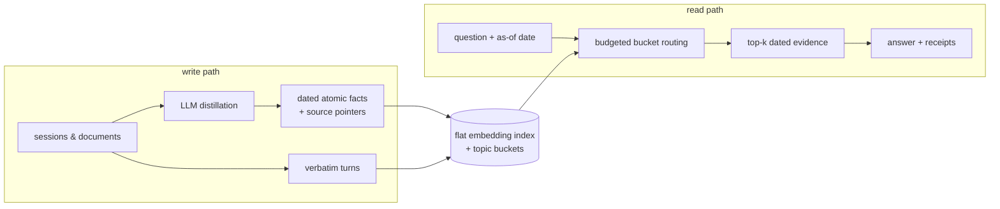

<p align="center">
  
</p>

<h1 align="center">MemBukkit</h1>

<p align="center">
  <a href="https://pypi.org/project/membukkit/"></a>
  <a href="https://github.com/memseekai/membukkit/actions/workflows/ci.yml"></a>
  <a href="https://github.com/memseekai/membukkit/blob/main/LICENSE"></a>
  <a href="https://www.python.org/downloads/"></a>
  <a href="https://github.com/memseekai/membukkit/blob/main/docs/index.md"></a>
</p>

**MemBukkit is long-term memory for LLM apps that shows its work.** It turns conversations and documents into dated atomic facts. When something changes (new rent, new job), the old fact is superseded, not deleted, so you can ask "what was true in May?" and get May's answer. Every answer ships with receipts: the facts used, where they came from, what the query cost. It sets the **state of the art on LongMemEval-S under the benchmark's official judge, 92.6%**, while reading a small fraction of the tokens full-context reading pays. Python, CLI, local GUI, HTTP, and MCP, all over the same stores. Apache-2.0.

<p align="center">
  <a href="https://github.com/memseekai/membukkit/blob/main/docs/index.md">Docs</a> ·
  <a href="https://github.com/memseekai/membukkit/blob/main/docs/guide/install.md">Install</a> ·
  <a href="https://github.com/memseekai/membukkit/blob/main/docs/guide/quickstart.md">Quickstart</a> ·
  <a href="https://github.com/memseekai/membukkit/blob/main/docs/guide/agents.md">Agents</a> ·
  <a href="https://github.com/memseekai/membukkit/blob/main/docs/guide/mcp.md">MCP</a> ·
  <a href="https://github.com/memseekai/membukkit/blob/main/docs/guide/demos.md">Demos</a> ·
  <a href="https://github.com/memseekai/membukkit/blob/main/docs/guide/benchmarks.md">Benchmarks</a>
</p>

<p align="center">
  
</p>

---

## Try it in one line

```bash
uvx --from "membukkit[all]" membukkit ui --demo personal-assistant
```

That opens the GUI on a preloaded demo store. No clone, no venv, and Node is never needed because the GUI ships prebuilt. With pip it's `pip install "membukkit[all]"`. Docker works too:

```bash
docker run -p 127.0.0.1:8377:8377 -v membukkit-data:/data -e OPENAI_API_KEY ghcr.io/memseekai/membukkit
```

**It runs fully local.** Point it at Ollama and nothing leaves your machine:

```bash
membukkit ask "what did I decide about the migration?" --store notes --llm ollama:llama3.1
```

Prefer a hosted model? Paste a key in the GUI, or `export OPENAI_API_KEY=sk-...`. Either way, the first ask downloads the retrieval weights once and caches them.

Every install path, including a dev clone: **[Install guide](https://github.com/memseekai/membukkit/blob/main/docs/guide/install.md)**.

## Python API

```python
from membukkit import Memory

mem = Memory.from_pretrained(llm="openai:gpt-4o-mini")
mem.add("I signed a lease, rent is $2100.", subject="alex", date="2024-01-10")
mem.add("Landlord raised rent to $2300.", subject="alex", date="2024-03-01")

r = mem.ask("How much is my rent?", as_of="2024-06-01")
print(r.answer)             # truth as of that date
print(r.est_reader_tokens)  # ~tokens the reader saw
print(r.evidence[0].status, r.evidence[0].source_ref)  # current|superseded + citation
```

`add` returns a **write receipt** (`n_stored`, `superseded`, `status`), so empty LLM extracts never look like success. The full CLI walkthrough of the same flow is in the [Quickstart](https://github.com/memseekai/membukkit/blob/main/docs/guide/quickstart.md).

## How it works

Long-term memory is an indexing problem before it is a reading problem. What the store commits to at write time decides what any reader can possibly see later. Everything in MemBukkit follows from that.



**Writing.** An LLM distills each session or document into dated atomic facts like `2024-01-08: rent is 800€`, and the verbatim source turns are stored right next to them. Every fact keeps a pointer to its source. Why both? Because an extractor decides at write time what will matter later, and it is sometimes wrong. The atomic lane gives the system dates and updates it can reason about. The verbatim lane keeps everything the extractor skipped. When a new fact contradicts an old one, the old one is marked superseded instead of deleted. That is what makes "what was true in May?" answerable.

**Indexing.** Both lanes go into one flat embedding index, optionally split into topic buckets with plain KMeans. No LLM-built graph, no ontology, no summary hierarchy. Structures like those bake their builder's assumptions into the index, and revising them means rebuilding everything. Here the index builds in seconds with zero LLM calls, and changing how you retrieve is a config change, not a migration.

**Reading.** A question opens the closest topic buckets until a scan budget is covered, then the reader answers from the top evidence: dated, source-linked lines, filtered to what was known at the as-of date. It reads a small slice of memory instead of everything, and it answers better because of it. See [Benchmarks](#benchmarks) for how much better.

**Receipts.** Every answer reports what it used and what it cost: tokens, estimated dollars, scan fraction, opened buckets, and each evidence line's status with its source turn or clause. The receipts are not decoration. In our research, hiding exactly the buckets a receipt names destroys the answer, while hiding random ones changes nothing. The trace really is the evidence trail.

**Optional: a BM25 lexical lane.** Everything above is dense retrieval, which is the shipped method and the one every number here was measured with. If your corpus is full of exact strings that embeddings blur together, error codes, filenames, rare identifiers, you can turn on a BM25 lane that searches the whole bank by term overlap and adds its hits to the routed pool before ranking. It is **off by default** and changes nothing until you ask for it:

```python
from membukkit import Memory
from membukkit.config import RetrievalConfig

mem = Memory.from_pretrained(retrieval=RetrievalConfig(lexical_lane=True))
```

Needs `pip install "membukkit[bm25]"`. How it fuses and what it costs: [Library API](https://github.com/memseekai/membukkit/blob/main/docs/guide/library.md#lexical-lane).

### Chosen by answer quality, not retrieval metrics

The research behind MemBukkit kept producing the same surprise: better retrieval did not mean better answers. Reading everything scored far below reading a routed slice. A stronger reranker did not beat plain cosine order. Extraction-heavy designs lost evidence that a flat two-lane index kept. So every retrieval policy that ships here was selected by one test: did the final answer get better?

That is also why nothing depends on our fine-tuned models. Swap in off-the-shelf weights, or an all open-weights stack, and the results hold. You are adopting an index design, not a checkpoint.

The numbers behind each of these claims are in [Benchmarks](#benchmarks) below. The full mechanism is in [Method](https://github.com/memseekai/membukkit/blob/main/docs/METHOD.md), and a research paper is under review. For how MemBukkit compares to file notes, plain vector RAG, and temporal graphs as categories, see [When to use](https://github.com/memseekai/membukkit/blob/main/docs/guide/when-to-use.md).

## Benchmarks

Every score here is graded by each benchmark's **official judge**, and every one is a frozen recipe that pins the reader, distiller, judge, encoder, and distillation cache. One command reruns it, and `--check` verifies your result against the expected band.

That first part is doing more work than it looks. Higher LongMemEval numbers exist, and they are graded by their own authors, in one case by the same model that wrote the answers. Under the official gpt-4o judge the field is MemBukkit 92.6, then Supermemory 85.2, then Zep 71.2. See [who judges what](https://github.com/memseekai/membukkit/blob/main/docs/guide/benchmarks.md#who-judges-what).

| Benchmark (what it stresses) | Stack | Score | Reproduce |
|---|---|---|---|
| **LongMemEval-S** (knowledge updates, temporal reasoning across sessions) | gpt-5.4 reader, official gpt-4o judge | **92.6%** | `membukkit bench --repro longmemeval-gpt54` |
| LongMemEval-S | gpt-4o-mini reader | **82.0%** (95% CI 78.6–85.4) | `membukkit bench --repro longmemeval-gpt4o-mini` |
| LongMemEval-S | all open weights: gemma-4-26b reader + distiller | **88.8%** | `membukkit bench --repro longmemeval-gemma` |
| **LoCoMo** (Mem0's protocol and judge, zero retuning) | gpt-4o-mini | **87.5%** | `membukkit bench --repro locomo-mem0` |
| **BEAM** (100K / 1M / 10M-token haystacks, official judge) | gemma-4-26b | **0.535 / 0.498 / 0.447** | `membukkit bench --repro beam-100k-gemma` |

What the research found, on LongMemEval-S (500 questions, official gpt-4o judge, paired comparisons sharing reader, judge, and ingestion):

- Full-context reading scores 56.4% against MemBukkit's 82.0% with the same reader and judge, a +25.6 point gap (paired 95% CI [20.8, 30.4]), while MemBukkit reads ~3.2k tokens per question instead of ~100k.
- Excluding the buckets an answer's receipt names collapses accuracy from 80.0% to 1.3%. Excluding a matched random set leaves it at 82.3%.
- Given identical ingestion, extraction-only Mem0 scores 21.4% on questions answered in the assistant's own replies, where the verbatim lane scores 92.9%. Lane ablation: verbatim-only 75.4%, atomic-only 58.0%, both 82.8%.
- Dropping the cross-encoder entirely and ranking the same opened region by plain cosine (83.4%, `--rerank-select none`) statistically ties the shipped hybrid config (82.0%, paired p=0.40). Swapping the fine-tuned encoder for an off-the-shelf one moves the score by just −0.4 (p=0.81). The reranker is tail insurance, not the headline.

Single-pass ask, no agentic re-query loops, official judges. LLM readers and judges are stochastic, so scores reproduce as bands, not bit-exact values. Judges, costs, and per-category breakdowns: [Benchmarks guide](https://github.com/memseekai/membukkit/blob/main/docs/guide/benchmarks.md).

### Retrieval, measured directly

Answer quality is one thing, retrieval is another, so there is a second suite that grades retrieval alone with no LLM and no judge in the loop: HotpotQA multi-hop, 1,000 questions, scored against [qmd](https://github.com/tobi/qmd) by the same metric functions over the same candidate sets.

A multi-hop question needs two documents, and one of two is a miss, not half a success. On finding **both**, MemBukkit's document-retrieval path reaches 87.4% against qmd's best backend at 86.1% while answering in 47ms against 1,222ms. A heavier configuration, swapping in a 0.6B encoder and adding query decomposition driven by a local 1.7B model, reaches 90.8%. On the bridge questions that actually require two hops the gap is 88.4% against 82.3%. qmd stays a little ahead at putting *one* right document in first place, 93.2% against 92.1%, a difference inside sampling noise.

Read it with the setup, which is in the [benchmark notes](https://github.com/memseekai/membukkit/blob/main/benchmarks/README.md): those rows measure the document-retrieval configuration of the stack rather than the chunked path `membukkit search` runs today, the candidate sets are small enough that both systems saturate at k=10, and qmd's lexical backend scored zero on these long natural-language queries in a way that looks like a configuration artifact rather than a real result.

Known limits, so nothing surprises you later: distillation is an LLM call per session at write time (cached), so the cost moves rather than vanishing. Updates supersede rather than overwrite, so the old fact stays stored, which is what makes as-of queries possible; when you want a fact gone for real, [delete it](https://github.com/memseekai/membukkit/blob/main/docs/guide/deleting.md). And the distiller bounds the atomic lane: small local models extract weaker facts, and the verbatim lane limits the damage.

## Bring your data

```bash
membukkit ui                                     # create a store → Ingest (drag & drop)
membukkit ingest ~/Downloads/WhatsAppChat.txt --store me   # or from the CLI
```

| Drop this | How you get it |
|---|---|
| **WhatsApp** `.txt` | Chat → Export → without media |
| **ChatGPT / Claude** ZIP | Settings → Export data (or `conversations.json`) |
| **PDFs / CRM CSV / notes** | HubSpot deals export, contracts, Notion MD zip, Obsidian folder, `./docs` |

Ask the same question at two dates and compare the receipts. Full steps per source: [Bring your own](https://github.com/memseekai/membukkit/blob/main/docs/guide/bring-your-own.md).

## MCP

A thin stdio server gives Cursor / Claude Desktop three tools over the same stores: `memory_add`, `memory_search`, `memory_ask`.

```bash
membukkit mcp --store notes
```

Client config and example prompts: [MCP guide](https://github.com/memseekai/membukkit/blob/main/docs/guide/mcp.md).

## Surfaces

| Piece | Role |
|---|---|
| **`Memory`** | `add` / `search` / `ask` / `delete` + write & ask receipts |
| **CLI / GUI** | ingest files, demos, explainability lab |
| **Local v1 HTTP** | `/api/v1/{store}/…` for agents on disk stores |
| **MCP** | Cursor / Claude tools over the same stores |

`MemorySystem` remains the full pipeline API. See [Library API](https://github.com/memseekai/membukkit/blob/main/docs/guide/library.md) and [Method](https://github.com/memseekai/membukkit/blob/main/docs/METHOD.md).

## Contributing & license

Contributions welcome, see [CONTRIBUTING.md](https://github.com/memseekai/membukkit/blob/main/CONTRIBUTING.md). Licensed under [Apache-2.0](https://github.com/memseekai/membukkit/blob/main/LICENSE).
